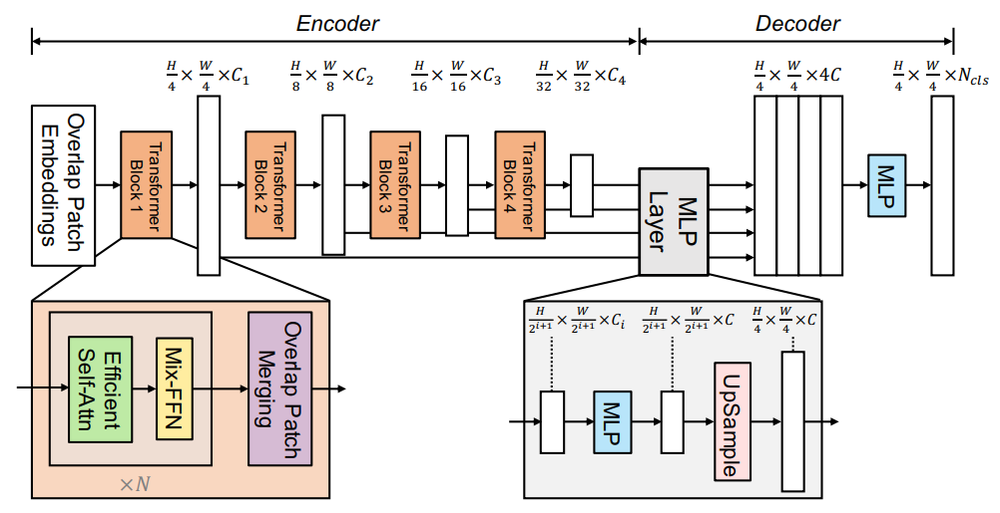

BoostCampAITECH
{:.note title="출처 및 참고"}

Vision Transformer가 Global 정보를 self-attention 기법으로 추출하여 Image Classification에서 높은 성능을 달성하였음 대표적으로 SETR, SegFormer, MaskFormer, SeMask가 있음

- SETR(2020): Semantic Segmentation Task에 ViT를 backbone으로 적용한 대표적인 모델
- **SegFormer(2021): 기존 ViT를 backbone으로 사용한 모델의 한계점(low efficiency, real time)을 극복한 단순하고 효율적인 모델**
- MaskFormer(2021): Transformer를 사용하면서 기존 classficiation loss에 binary mask loss를 추가한 모델
- SeMask(2022): Pretrained된 hierarchical transformer backbone에 semantic layer를 추가한 모델

# SegFormer

Transformer 구조를 semantic segmentation에 사용한 SegFormer 구조로 네트워크 속도 향상에 중점을 두면서도 성능을 최소한의 파라미터로 극대화한 모델

1. 16x16 크기의 패치를 사용하는 ViT와 달리 4x4 크기의 패치를 사용
2. 위의 패치를 계층적인 Transformer 인코더의 입력으로 사용, 오리지널 입력 해상도의 {1/4, 1/8, 1/16, 1/32}의 multi-level features를 획득
3. multi-level features를 MLP decoder로 입력
4. 결과적으로 $$H/4 * W/4 * N_{cls}$$의 해상도를 가지는 segmentation mask를 예측

- **Transformer Encoder**
    1. 고해상도 특징과 저해상도 특징을 유지하는 구조, “multi-level features” 생성 → Local Continuity를 보존하기 위한 **“overlapping patch merging”**
    2. Attention의 높은 계산 복잡도를 줄이는 **“Efficient Self-Attention”**
    3. Train/Test의 resolution 차이로 Positional Encodeing에서 발생하는 성능 감소를 위한 **“Mix- FFN”**
- **lightweight All-MLP Decoder**

## Encoder

high resolution 특징과 low reoslution 특징을 유지하는 Hierarchical(multi-level) fatures를 생성(ViT는 하나의 해상도의 feature map만 활용)

계층적인 구조가 가능한 이유는 중간중간에 patch merging을 하여 해상도를 줄임

**왜 계층적인 구조를 사용할까?**

CNN은 이미 계층적인 구조를 가지고 있음

기존 CNN의 백본은 고정된 Kernel size에 중간 Maxpooling으로 이미지 해상도를 줄여가면서 receptive filed를 늘려가는 구조, **이처럼 CNN은 semantic segmentataion에서 receptive filed를 늘리려고 여러 기법을 사용하고 있음**

Transformer는 애초에 전체 픽셀에 대해서 **전역적으로 attention 값을 구하기 때문에 receptive filed가 기본적으로 큼**

이 구조를 도입하면 다양한 해상도에서 큰 receptive filed로 풍부한 표현력을 학습함

기본적으로 Transformer를 사용하는 구조는 입력과 출력의 차원이 같아서 계속해서 전역적인 수용필드를 가지는데 이는 해상도가 올라갈 수록 attention 값을 구해야하는 영역도 넓어져 계산량이 기하급수적으로 올라감

**반면, 계층적인 구조는 계속해서 해상도를 줄이므로 줄어든 해상도에 대한 attention 값을 구하여, 다양한 해상도의 다양한 Representataions뿐만 아니라 계산 속도에도 이점이 있음**

### Overlapping patch merging

**기존 patch merging은 2 x 2 x $$C_i$$의 해상도를 가지는 하나의 패치가 1 x 1 x $$C_{i+1}$$로 사영되어 해상도를 줄임**

이 과정에서 해상도가 줄어들면서 예를 들어 $$F_1(\frac{H}{4}$$ X $$\frac{W}{4}$$ X $$C_1$$)가  $$F_2(\frac{H}{8}$$ X $$\frac{W}{8}$$ X $$C_2$$)로 해상도가 감소함

**→ 모델의 모든 계층적 구조에서 일관되게 적용되며, 효율적으로 특징 추출을 수행하고 네트워크의 깊이를 증가시키면서도 계산 비용을 절감함, 이러한 방식은 SegFormer가 높은 해상도의 이미지에서도 효과적으로 작동할 수 있도록 도움**

인접 픽셀의 값이 유사한 경우 Image는 local continuity을 가짐

**패치들을 겹치지 않게 독립적으로 해상도를 줄여주는 방식은 local continuity(패치간 경계에서 불연속성)를 보존하기 어렵다고 함**

그래서 위와 같이 겹치게하여 merging하였고 **Transformer Block 1~4를 통해서 hierarchical features를 생성함**

K=patch_size, S=stride, P=padding

- input: 512x512, 3
- [K=7, S=4, P=3] 커널 사용
    - stage1: 128x128, 32
- [K=3, S=2, P=1] 커널 사용
    - stage2: 64x64, 64
    - stage3: 32x32, 160
    - stage4: 16x16, 256

### Efficient Self-Attention

기존 Encoder의 self-antteiton layer의 **문제점인 높은 계산 복잡도 $$O(N^2)$$**을 가짐, N=HxW으로 해상도가 커지면 커질수록 더 커짐

기존의 multi-head self-attention 공식으로 각 head Q, K, V는 동일한 dim NxC를 가짐(N=HxW(시퀀스 길이))

**효율적으로 Attention을 계산할 수 있도록 “Efficient Self-Attention”을 도입함.**

**시간을 더 줄이기 위해서 Reduction ratio(R)을 도입하여 K, V의 sequence length를 줄이는 방식**

Key K와 Value V의 sequence 길이를 $$R^2$$배로 줄임, 이를 위해서 먼저 K를 아래 수식 처럼 reshape하고, 이를 입력으로 받아 C차원으로 선형 변환 과정을 거침

$$O(N^2)$$에서 $$O(N^2/R)$$로 줄어듦

Transformer Block 1~4까지 Reduction ration(R)을 설정하는데 논문에서는 [64, 16, 4, 1]로 설정

### Mix-FFN

**기존 ViT에서 Positional Encoding의 문제점**: 해상도가 고정되어 있어서 test set의 해상도가 학습 시와 다를 경우 interpolation을 하는데 segmentaion task에서 해상도가 다른 경우가 많기에 성능 저하로 이어짐

**→ Feed Forward Network(FFN)에서 3x3 Conv를 직접 사용하여 leak location information에 대한 zero padding에 대한 영향을 고려하는 “Mix-FFN” 제안**

$$x_{in}$$은 self-attention 모듈의 feature이고, Mix-FFN은 3x3 conv와 MLP를 각 FFN에 혼합

3x3 Conv가 Transformer에 대한 위치 정보를 제공하기에 충분하다는 것을 보여주며 효율성을 위해 depth-wise convolution을 사용

이와 같은 설계로 저자는 semantic segmentataion 작업에서 feature map에 PE를 추가할 필요가 없다고 주장함

## Decoder

**효율적이고 간단한 Decoder(lightweight All-MLP)**: MLP Layer로 구성된 Lightweight Decoder를 설계하여 연산량을 줄임

간단한 디코더는 계층적 트랜스포머 인코더가 기존 CNN 인코다보다 더 큰 Efficient Receptive Field(ERF)를 갖는다는 점

**ALL-MLP 단계**

1. multi-level feature들의 동일한 channel(C)로 통일
2. feature size를 원본 image의 1/4 크기로 유지 및 Up-sampling
3. feature들을 concatenate하고 4배로 증가한 channel을 C로 변경
4. 최종 segmentation mask를 예측

# Effective Receptive Field Analysis

**Semantic Segmentation에서 context information을포함하도록 큰 receptive filed를 유지하는 것은 핵심 문제**

논문에서 ERF를 사용하여, Transformer 기반 구조에서 제안한 MLP 디코더 설계가 transformer에서 효과적인지 시각적으로 해석

아래는 4단계 Encoder와 Decoder Head의 ERF를 시각화한 사진 

- The ERF of DeepLabv3+ is relatively small even at Stage-4, the deepest stage
- SegFormer’s encoder naturally produces local attentions which resemble convolutions at lower stages, while able to output highly non-local attentions that effectively capture contexts at Stage-4
- As shown with the zoom-in patches in Figure 3, the ERF of the MLP head (blue box) differs from Stage-4 (red box) with a significant stronger local attention besides the non-local attention

CNN의 제한된 receptive filed 때문에 ASPP와 같은 context module에 의존해야하는데 receptive filed는 확대해도 무거워짐, 논문처럼 Transformer의 non-local attention을 활용하여 복잡하지 않으면서 더 큰 receptive filed를 확보함

동일한 디코더 설계는 CNN 백본에서는 작옹이 안됨, Stage-4의 제한된 receptive filed에 의해 전체 receptive filed가 상한을 가지기 때문임

또한 SegFormer의 디코더 디자인은 high local/non-local attention을 모두 생성하는 트랜스포머의 이점을 취함

이 둘을 통합하여 MLP 디코더는 적은 파라미터 추가만으로 상호보완적이고 강력한 표현 생성, Stage-4의 non-local attention만 단독으로 사용하기에는 좋은 결과를 내기에 부족함

# 구현(SegFormer-MiT-B0)

https://github.com/NVlabs/SegFormer/tree/master

논문과 구현의 차이점으로 **Transformer Block 내 순서 차이**가 있음

논문은 Efficient-Self-Attn → Mix-FFN → Overlap Patch Merging이지만, **Code에서는 Overlap Patch Merging →  Efficient-Self-Attn → Mix-FFN의 순서**

