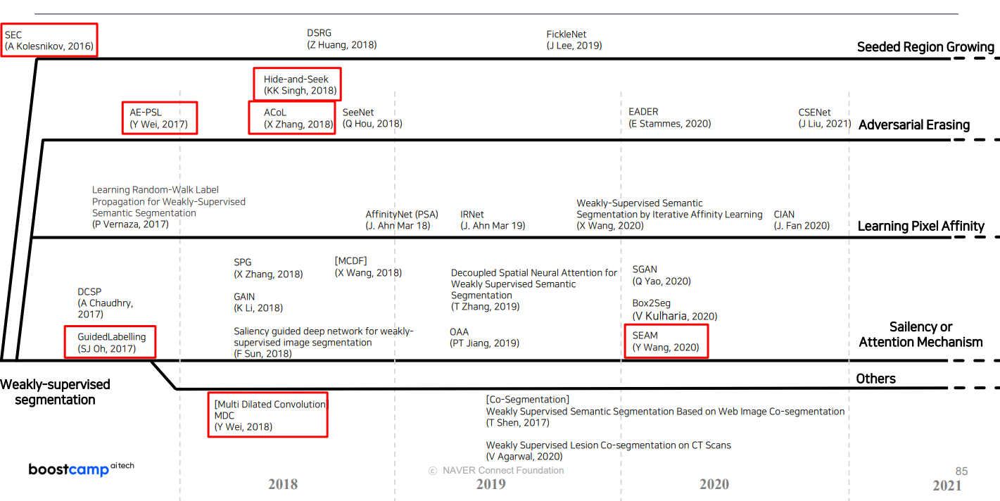

[KL-Divergence Loss 간단 설명](https://hwiyong.tistory.com/408)
BoostCampAITECH
{:.note title="출처 및 참고"}

* this unordered seed list will be replaced by the toc
{:toc}

# Weakly Supervised Semantic Segmentation(WSSS)

**pixel-level labels를 하는 annotation 시간이 오래 걸림**

**Weak Supervision: 테스트 시에 요구하는 outpupt보다 학습 시에 더 간단한 annotation을 이용하여 학습**

# Naïve approach

이러한 방식은 pseudo-mask 의 결과가 좋지 못함

1. 가지고 있는 정보인 image level label을 활용하기 위해 classification 모델 학습
2. 학습한 classficiation 모델을 통해서 CAM, Grad-CAM 혹은 attention 추출
3. 추출한 경과물은 pseudo mask로 segmentataion 모델 학습에 이용
4. inference시에는 segmentataion 모델만 있으면 됨

# CAM 기반의 접근

이러한 방식은 Classification 모델을 학습하면서 생성이 가능하며 특정 class의 물체가 사진의 어떤 영역에 있는지 유추가 가능하짐, 유추한 결과를 WSSS label로 활용

## Image Feature

- 모델은 학습 시에 구분할 feature map을 생성하고 각 feature map은 고양이인지 강아지인지를 구분하기 위한 정보를 담고 있음
- feature map은 fletten/pooling되어 이미지가 어떤 클래스인지 판별하는데 쓰이며 GAP의 결과물은 각 feature map의 공간적인 평균값으로 해당 feature map을 대표하는 값임
- Classifier는 GAP(혹은 flatten)된 feature vector의 각 원소에 class 별로 다른 weight(중요도)를 주어서 scoring

## CAM

- Classficiation을 통해서 학습한 중요도를 GAP 이전의 feature map에 곱함
- 어떤 영역이 class 판단에 있어서 중요했는지 알 수 있으며 Score가 높은 영역이 중요한 영역이 됨

**CAM의 문제점:** 마지막 레이어는  GAP를 가져야하며 마지막 레이어에서만 CAM을 만들 수 있음

## Grad-CAM

- 특정 feature map에 변화가 있을 때, class score에도 변화가 크게 일어난다면 중요도가 높은 feture라고 생각할 수 있음
- 변화량 / 변화량 = 기울기 = 미분값으로 중요도가 정해지는 것을 알 수 있음

# CAM을 sharp하게

**CAM의 output의 특징으로 CAM의 결과가 Sharp하지 않고 동글동글한 모양으로 생성:** 입력 이미지보다 작은 feature map을 통해서 CAM을 생성하고 CAM을 이미지와 동일한 크기로 만들면서 동글동글해짐 동글동글동글동글

## 물체의 형태를 알 수 있는 정보를 제공

“Seed, Expand and Constrain: Three Principles for Weakly-Supervised Image Segmentation”, ECCV 2016

CRF를 이용해서 물체의 형태를 정교하게 하여 segmentation 모델의 output과 CRF의 output이 같아지도록 KL Divergence Loss(Kullback-Leibler Divergence의 줄임말로, 두 확률 분포간의 차이를 측정하는 비대칭적인 척도를 의미)

## Transfer Learning 이용

“Exploiting Saliency for Object Segmentation from Image Level Labels”, CVPR 2017

Object-ness(saliency)를 학습한 모델을 준비하고 해당 모델의 guide를 통해서 학습

## Self-supervised Learning을 이용

“Self-supervised Equivariant Attention Mechanism for Weakly Supervised Semantic Segmentation”, CVPR 2020

- 기존의 CAM은 input 이미지 사이즈에 따라 다른 결과를 보임
- input 이미지 사이즈에 관계 없이 CAM이 같은 모양을 같도록 L1 Loss
- ER Loss를 통해 input 이미지 크기와 관계없이 비슷한 CAM을 생성

# CAM 확장

CAM의 output의 특징 두번째는 특징적인 영역(Classification할 때 중요한 부분)에만 집중한다는 점

**특징적인 부분만 집중하는 이유**

1. Classification을 통해 간접적으로 학습
2. 다른 class임을 확실하게 알 수 있는 특징에 의존: 몸보다 얼굴이 강아지 고양이 구별 편함
3. 같은 class의 물체끼리 서로 다른 모습을 보여 공통적으로 보이는 특징에 의존

## 특징적인 영역을 지운 사진을 다시 학습하여 CAM을 얻음

“Object Region Mining with Adversarial Erasing: A Simple Classification to Semantic Segmentation Approach”, CVPR 2017

1. 입력 이미지를 Classfication Network1을 통해 학습하고 CAM을 추출
2. 1에서 만든 CAM의 결과 영역을 제거(제거: 전체 이미지의 평균으로 대체)
3. 1번의 너트워크와 다른 Classfication Network2로 학습을 진행해서 CAM 결과를 생성
4. 학습이 완전히 끝날 때까지 반복

→ Step이 진행될 수록 다른 영역에 CAM이 생성됨

**문제점**

1. Output 별로 다른 모델을 학습해야하는 번거러움: 모델 3개가 필요
2. Class 별로 필요한 Step이 다름(말은 3개로도 충분하게 pseudo-mask가 생성되지만 의자는 충분하지 않음) 그래서 과도한 step으로 인해서 Over-Erasing 현상(과도한 step으로 인해 물체가 아닌 영역까지 mask 생성)이 발생함

## Input 이미지의 random 영역을 지움

 “Hide-and-Seek: A Data Augmentation Technique for Weakly-Supervised Localization and Beyond”, TPAMI 2018

Input 이미지에서 random한 patch를 지워서 최대한 다양한 영역에서 특징을 뽑을 수 밖에 없도록 강제, 얼굴 영역이 지워진 경우 다리를 보고 강아지라는 것을 알게 되도록 학습하여 결과적으로 한 개의 네트워크로 Erasing과 비슷한 효과가 생김

1. 각  패치별로 0.5의 확률로 숨길지 말지를 결정 → 이후, 첫번째 Epoch의 학습을 진행
2. 1의 숨기는 과정을 Epoch마다 반복해서 수행

→ CAM의 영역이 넓어진 것을 확인할 수 있음

## 방법 1의 Erasing을 네트워크 하나로 수행

“Adversarial Complementary Learning for Weakly Supervised Object Localization”, CVPR 2018

통합을 통해서 더 넓은 mask를 생성함, 첫 번째 step에서 검출된 영역이 두 번째 step에서는 검출되지 않음

## 다양한 Receptive field 사용

“Revisiting Dilated Convolution: A Simple Approach for Weakly- and Semi- Supervised Semantic Segmentation”, CVPR 2018

Receptive filed가 좁을수록 특징적인 영역이 좁고, 넓을 수록 특징적인 영역이 넓음

## Mixup

“Revisiting Dilated Convolution: A Simple Approach for Weakly- and Semi- Supervised Semantic Segmentation”, CVPR 2018

